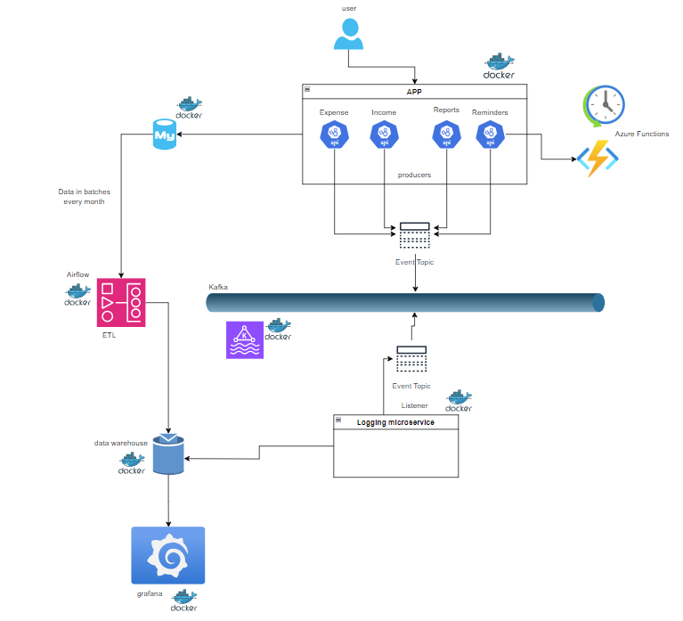

I have worked on a project that combines Backend and Data Engineering. I created a CRUD app (an Expense Tracker) using SpringBoot. Then, I used the data generated by the users to track app usage and collect useful user data in the finance domain. For tracking app usage I implemented Data Streaming of event logs via Apache Kafka, and for collecting useful data on spending habits and earnings I created an ETL job with Airflow. All collected data was stored in a Data Warehouse and visualised in Grafana. Some functionalities like weekly and monthly reminders for premium users were implement with Azure Functions and deployed on cloud. Naturally, everything was dockerized for consistency and dependency management.

